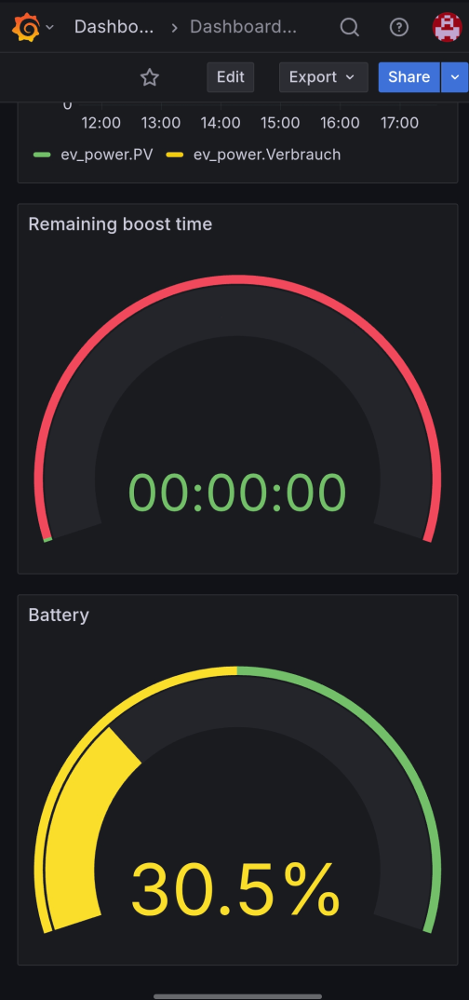
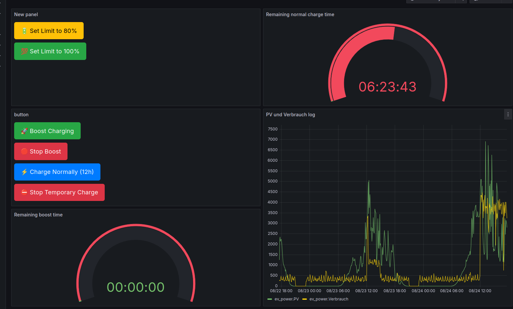

# Smart EV Charging System

This project provides a backend system for solar-aware EV charging, with Grafana visualization, FastAPI control interface, and optional vehicle API integration (PSA).
<table>
  <tr>
    <td></td>
    <td></td>
  </tr>
</table>
---

## ⚙️ First-Time Setup

Clone the repository with 

```bash
git clone --recurse-submodules https://github.com/12114770/pycontrol
```

Run the initial system setup script once:

```bash
sudo bash setup_service.sh
```

This installs dependencies, sets up InfluxDB, Grafana, NGINX, ngrok, and restores configs.
You will need to adjust the IP-Adress in the start_service.sh file according to what ngrok says on their website. 

Then adjust the Ip-Addresses in the v1.1 or v1.2 utils.py file.

---

## 🚘 Choose Your Version

- Use **`v1.2`** if you want to control the vehicle (e.g. set SoC to 80%) using [psa_car_controller](https://github.com/flobz/psa_car_controller).
- Use **`v1.1`** if you only want charging control based on solar data (no car integration).

---

## ▶️ Start the Service

After setup:

```bash
cd v1.2 && ./start_service.sh
```

Or, for the simpler variant:

```bash
cd v1.1 && ./start_all.sh
```

This starts the FastAPI backend, control logic, Grafana, NGINX, and ngrok.

Then you will need to copy the grafana, .json dashboard into your Grafana server on the website.

If v1.2, please also follow the instruction to github.com/flobz/psa_car_controller, which is included as a submodule.

If there are any questions just contact me unter lukas.sichert@student.tuwien.ac.at.

---


